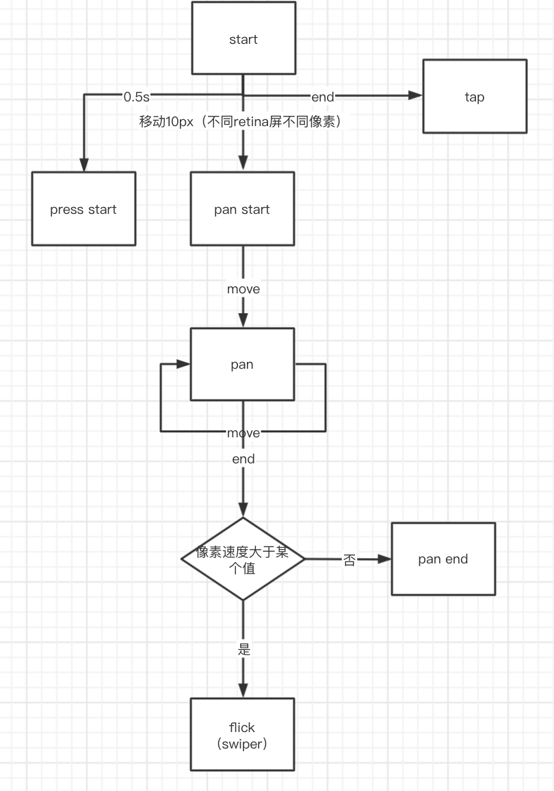

## 动画实现方式

1. setInterval

  ```js
  // 16毫秒为一祯
  setInterval(() => {}, 16);
  ```

2. setTimeout

  ```js
  let tick = function () {
    setTimeout(tick, 16);
  };
  ```

3. requestAnimationFrame

  ```js
  let tick = function () {
    let handler = requestAnimationFrame(tick);
    cancelAnimationFrame(handler);
  };
  ```

  ## 手势

  

## 事件

1. 自定义事件

  ```js
  const event = new Event(typeArg, eventInit);
  eventInit = {
    bubbles: false, // 是否冒泡， 默认false
    cancelable: false, // 是否能被取消， 默认false
    composed: false // 是否会在影子DOM根节点之外触发侦听器, 默认false
  }
  ```

2. 触发事件

  ```js
  cancelled = !target.dispatchEvent(event)
  // 当该事件是可取消的(cancelable为true)并且至少一个该事件的 事件处理方法 调用了Event.preventDefault()，则返回值为false；否则返回true
  ```